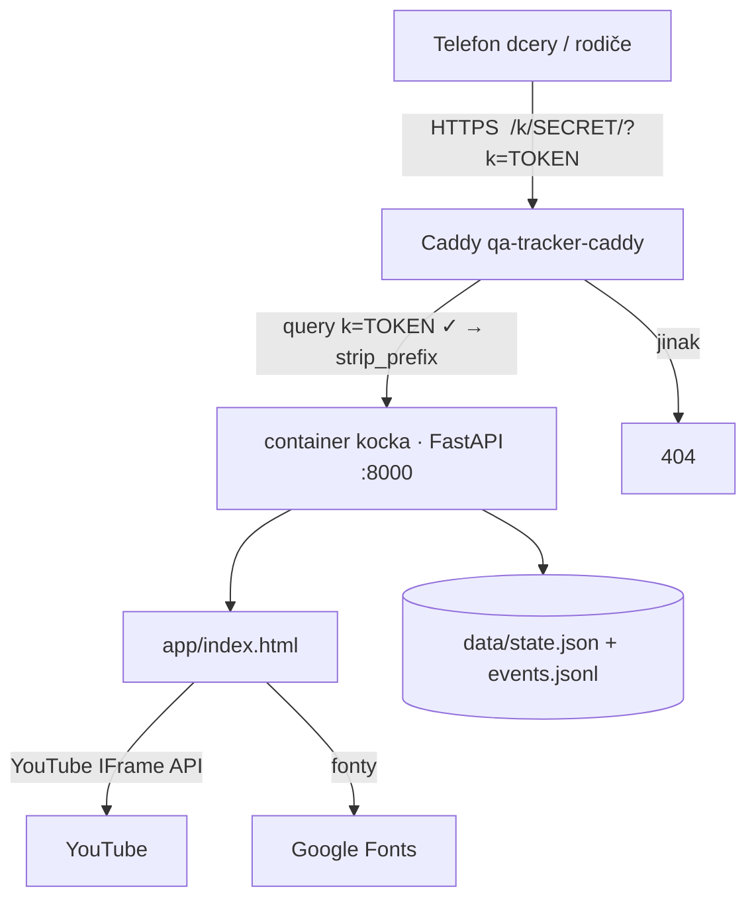

# Architecture

> Living document. Aktualizuj v stejném commitu jako jakoukoli architektonickou změnu.

## Overview

Úroková kočka je malá webová aplikace pro jednoho uživatele (dcera, 15) a jednoho správce (rodič). Denní check-in = dokoukané priming video → vklad + složený úrok. Cílem je, aby dcera *viděla* exponenciální křivku růst z vlastního chování. Průběh je uložený na serveru martin1, takže funguje z libovolného telefonu a rodič ho vidí taky.

## System diagram



## Komponenty

| Komponenta | Cesta | Zodpovědnost |
|---|---|---|
| Frontend | `app/index.html` | UI (Dnes / Graf / Kočka / Odměny), matematika úročení, YouTube přehrávač + detekce konce, kočka (SVG, 6 vývojových stupňů, výbava), easter eggy, odměny, nabídky, rodičovské nastavení, sync se serverem |
| Backend | `server/main.py` | statika + `GET/PUT /api/state`, `GET /api/events`, `GET /api/health`; atomický zápis stavu, append-only event log |
| Reverse proxy | `deploy/Caddyfile.snippet` (v `/home/bobek/jarabot-metrics/Caddyfile`) | tajná cesta + token → 404 bez tokenu; `uri strip_prefix` |
| Container | `deploy/Dockerfile`, `deploy/docker-compose.yml` | `python:3.12-slim`, non-root uid 1000, read-only FS, `./data` bind mount, síť `jarabot-metrics_default` |
| Testy | `bin/e2e-smoke`, `tests/` | API contract (curl), `node --check` inline JS, Playwright mobile Chromium |

## Data flow

1. Stránka se načte s prefixem `/k/<secret>/` a `?k=<token>`; všechny API požadavky jsou relativní (`api/state` + `location.search`), takže token a prefix procházejí přes Caddy.
2. `pullSync()` → `GET api/state`. 404 = server prázdný → klient pošle svůj stav; 200 = server přepíše localStorage (server je zdroj pravdy).
3. Rodič nastaví YouTube URL. Dcera zvolí level: **základní** (přehrávač startuje na `settings.basicStart`, výchozí 150 s) nebo **pokročilý** (celé video); volba je v `state.level`. `renderCheckin()` vloží YouTube IFrame Player; na `ENDED` se zavolá `doCheckin('video')`. Fallback: po `minMinutes` od prvního `PLAYING` (nebo od kliknutí na externí odkaz) se odemkne nouzové tlačítko `doCheckin('button')`.
4. `doCheckin()` přidá check-in pro dnešní datum, `recompute()` přepočte řetězec (`balance = (balance + vklad) × 1,03`), `save(events)` → localStorage + debounced `PUT api/state` s eventy.
5. Oslava: 3 obrazovky (gratulace k N. dni → „Dnes jsi kočičku vylepšila o“ s count-upem → nová odměna, pokud padla na tento den).
6. Na dni `offerDays` (33, 66) se zobrazí nabídka výběru; `kept`/`taken` se zapíše do `offers`, `taken` navíc do `withdrawals` (zůstatek → 0, vklady pokračují).
7. Před `startDate` (31. 8. 2026) je check-in vypnutý a běží odpočet; kočka i grafy fungují.

## Matematika

- Vklad `d = ceil(T·r / ((1+r)·((1+r)^N − 1)))` → pro T = 10 000, r = 0,03, N = 100 je `d = 16 Kč`, konec ≈ 10 008 Kč.
- Úrok se připisuje jen ve dnech s check-inem (vynechaný den = prodloužení, ne penalizace).
- Nabídka: `take = balance_now + projekce(0, zbývající dny)`, `keep = projekce(balance_now, zbývající dny)`, cena = `keep − take`.

## API endpoints

| Method | Path | Popis |
|---|---|---|
| GET | `/api/health` | `{ok, hasState, time}` |
| GET | `/api/state` | `{state, updatedAt}`; 404 pokud nic není uloženo |
| PUT | `/api/state` | body `{state, events:[{type,payload}]}` → atomický zápis `state.json`, append do `events.jsonl`; 413 nad 512 kB; 422 při špatném tvaru |
| GET | `/api/events?limit=200` | poslední eventy z logu |
| GET | `/` | `app/index.html` (`Cache-Control: no-cache`) |

## Stav (state.json)

```json
{
  "settings": {"rate":0.03,"target":10000,"days":100,"deposit":16,"videoUrl":"","minMinutes":5,"pin":"1234","catName":"Mince","offerDays":[33,66],"startDate":"2026-08-31","basicStart":150},
  "checkins": [{"date":"2026-08-31","n":1,"deposit":16,"interest":0.48,"before":0,"after":16.48}],
  "withdrawals": [{"afterN":33,"date":"…","amount":907.68}],
  "offers": {"33":"kept"},
  "claimed": ["r1"],
  "videoStartedAt": null, "videoStartedFor": null, "level": "basic", "tutorialDone": false
}
```

Eventy (`events.jsonl`, jeden JSON na řádek): `checkin`, `offer`, `withdrawal`, `settings`, `test-day`, `undo-day`, `restore`, `reset`.

## Kočka

- Stupně podle počtu check-inů: kotě (0) → kočka (10) → velká kočka (25) → mini puma (45) → malá lvice (65) → lvice (85). Mění se měřítko, barva srsti, tvar uší, čumák, střapec na ocase.
- Výbava (gear) z odměn: obojek, korunka, brýle, šátek, plášť, svaly, křídla, zlatý obojek, trofej (aura). Hračky se zobrazují kolem kočky, kulisa mění pozadí, titul je odznak u jména.
- Easter eggy: `EGGS[]` s `min` stupněm; denní výběr `todaysEgg()` je deterministický z (dny od startu + stupeň). Každý 5. klik = tajná „Mám tě ráda“. Animace přes Web Animations API na skupinách `.head .eyes .tail .pawR .arms .body`.

## Externí závislosti

- YouTube IFrame API (`https://www.youtube.com/iframe_api`) — detekce konce videa; při chybě fallback na odkaz + časovač
- Google Fonts (Fredoka, Nunito) — s fallback stackem
- Caddy na martin1 — TLS, tajná cesta, token

## Environment variables

| Var | Default | Účel |
|---|---|---|
| `DATA_DIR` | `./data` (v containeru `/data`) | kam se ukládá `state.json` a `events.jsonl` |
| `APP_DIR` | `./app` | odkud se servíruje statika |

## Jak spustit lokálně

Viz `CLAUDE.md` → Setup / Spuštění.
